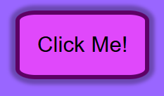

# Project Basic Button
<em>by Kalecia McNeal</em> 

## 🎯 Objective
Create a default button that can be used in any project with only simple edits 

## 📝 Goal
The main goal of this project is to create a simple button that can be used for any project as a template

## 🛠️ Tools & Tech
- Basic HTML5 Button and Semantic syntax 
- Simple CSS3 Styling 
- Visual Studio Code 
- Chrome Web Browser 

## 📌 Outcome
With the project all finished, here are the final results:
- A light periwinkle background 

- A button with the words "Click Me" on them matched with a light purple background and black text 

- A blue color change once the user hovers over it 

- Then last but not least, the user is able to click on the button when it turns reddish-pink 

The screenshot can be located here: 

## 🔍 Reflection
Completing this button was easier than expected. The only issue I really had was trying to make the button clickable. After doing some research, I was able to understand how the translateY() property worked thus solving the problem. 

## 🙏 Acknowledgements
I’ve learned and built these projects using resources like:
- [MDN Web Docs](https://developer.mozilla.org/)
- [W3Docs](https://www.w3docs.com/)
- [HTML Academy](https://htmlacademy.org/)

## 📬 Contact
Here is my contact info for more questions:
- **GitHub:** [Kalecia24824](https://github.com/Kalecia24824)
- **LinkedIn:** [Kalecia McNeal](https://linkedin.com/in/kalecia-mcneal)
- **Email:** [kaleciamcneal@gmail.com](mailto:kaleciamcneal@gmail.com)