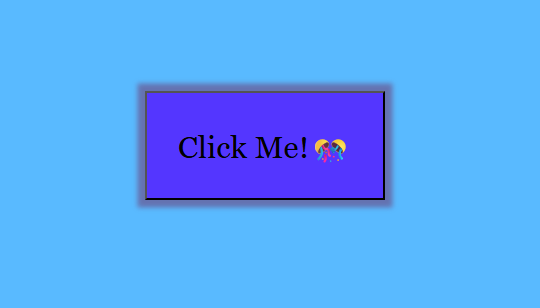

# Project Confetti Button
<em>by Kalecia McNeal</em> 

## 🎯 Objective
Create a button that shoots out confetti when the user clicks on it

## 📝 Goal
The main goal of this project is showcase a fun visual interaction through the user's actions 

## 🛠️ Tools & Tech
- HTML5
- CSS3 
- JS ES6+
- Visual Studio Code 
- Chrome Web Browser 

## 📌 Outcome
With the project all finished, here are the final results:
- A simple button with a periwinkle blue normal state with the words (Click Me!🎊) against a sky blue background.
- The button turns dark blue with white lettering for contrast. 
- An confetti effect that activates once the user clicks on the button.

The screenshot can be located here: 

## 🔍 Reflection
This was one of my favorite projects to do. Since I practiced with buttons, the HTML was easy enough to set up. I had an easier time with CSS this go around because I chose to play around with each CSSproperty to understand how they worked. As for the JavaScript, I will say creating the event was simple after some research. The only issue I encountered forgetting to add an confetti script effect. Overall if I add to do this again, I want the button to stay on the page during the effect.

## 🙏 Acknowledgements
I’ve learned and built these projects using resources like:
- [MDN Web Docs](https://developer.mozilla.org/)
- [W3Docs](https://www.w3docs.com/)
- [HTML Academy](https://htmlacademy.org/)

## 📬 Contact
Here is my contact info for more questions:
- **GitHub:** [Kalecia24824](https://github.com/Kalecia24824)
- **LinkedIn:** [Kalecia McNeal](https://linkedin.com/in/kalecia-mcneal)
- **Email:** [kaleciamcneal@gmail.com](mailto:kaleciamcneal@gmail.com)